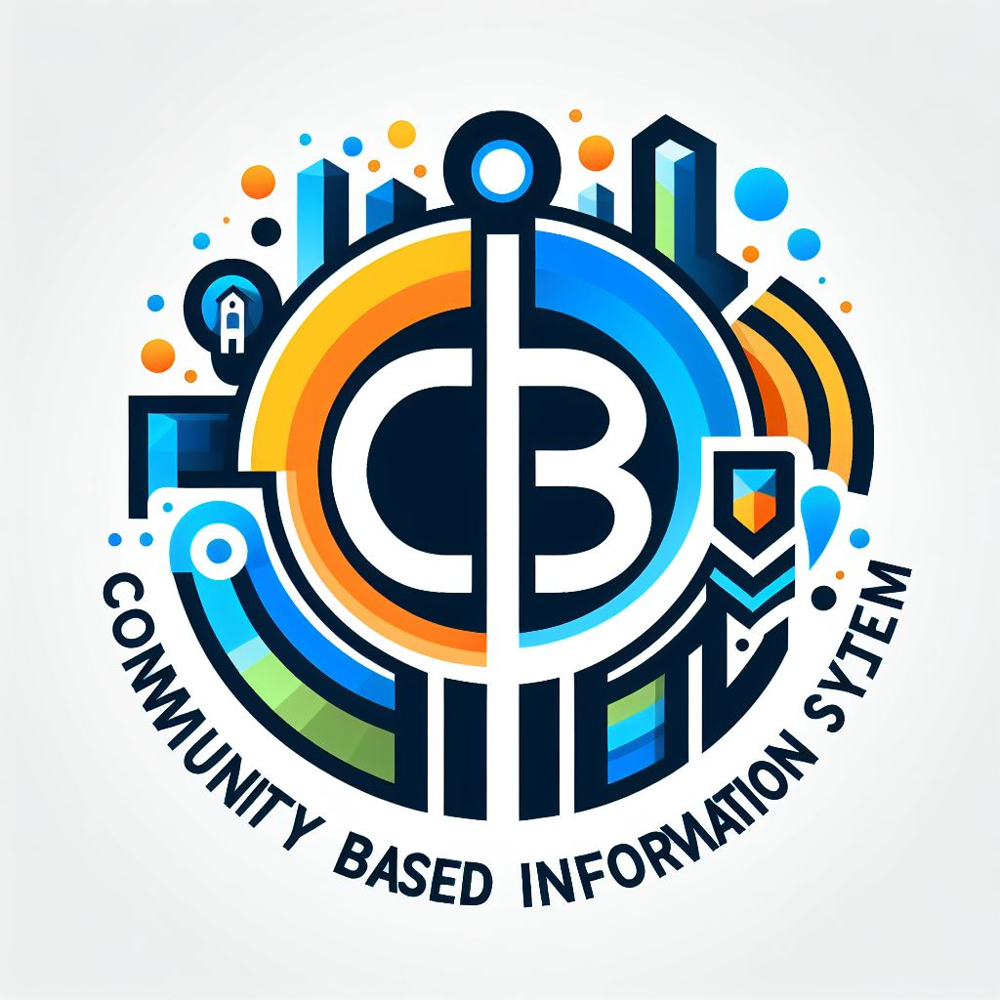

# Welcome to CBIS

CBIS is a community-based information system. The aim of this project is to assist people in creating various communities and making it easier for users to discover information within the interested communities.

Tech Stack:
- Django 4.2
- PostgreSQL 13
- nginx 1.21
- Leaflet 1.9.3

---
## Installation
You will need [Docker](https://docs.docker.com/get-docker/) and [Docker Compose](https://docs.docker.com/compose/install/) installed on your system. 

1. Edit .db.env.sample and .env.sample files according to your needs, and rename the files to .db.env and .env
2. From the project root directory, run docker compose up -d
3. After the images are built and containers are created, the system will be available at http://localhost:8080/
4. Build search indexes using `docker compose exec web python manage.py buildwatson`
5. You can create a superuser using `docker compose exec web python manage.py createsuperuser`